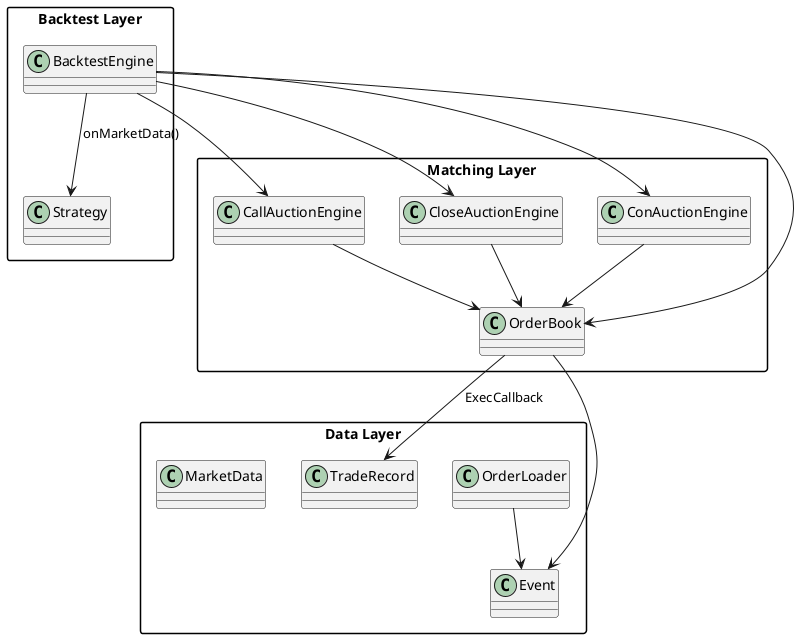

# README_DESIGN.md

> **项目名称**：`wangcai_orderbook_cpp`  
> **文档类型**：设计文档（Design README）  
> **目标读者**：需要深入理解撮合/回测框架内部实现、扩展点、性能瓶颈的开发者。  
> **最后更新**：2025-07-24 11:04:20

---

## 1. 背景与目标

证券市场撮合与回测的难点在于 **规则复杂**、**性能要求高**、**状态变化快**。本项目希望在 C++ 层面实现一个高性能、可扩展的撮合与回测框架，完整覆盖以下阶段：

- **开盘集合竞价（09:15 ~ 09:25）**：实时预测开盘价，09:25 一次性撮合；
- **连续竞价（09:30 ~ 14:57）**：逐笔撮合，价格优先 / 时间优先；
- **收盘集合竞价（14:57 ~ 15:30）**：实时预测收盘价，15:30 一次性撮合（规则可与开盘不同）。

同时，框架提供：
- 策略接口（`Strategy`），使用者可实现 `onMarketData()` 来发单；
- 成交/撤单回调与记录（`TradeRecord`）；
- 实时预测价回调（`PxCallback`）；
- 高性能订单簿结构（`OrderBook` + 桶链表 + Fenwick 树 + 对象池）；
- 统一的事件流（订单/撤单 CSV -> `Event` -> 引擎）。

---

## 2. 总体架构概览

```
┌────────────────────┐
│    BacktestEngine  │  ← 回测主控：状态机驱动、策略运行、记录输出
└───┬──────────────┬──┘
    │              │
    ▼              ▼
┌──────────────┐  ┌──────────────────┐
│ CallAuction  │  │   ConAuction     │   ← 不同阶段使用不同撮合引擎
│  Engine      │  │    Engine        │
└──────┬───────┘  └─────────┬────────┘
       │                     │
       ▼                     ▼
┌──────────────────────────────────┐
│         OrderBook (订单簿)        │ ← 桶结构、Fenwick、定位器、ID 映射
└────────────────┬─────────────────┘
                 │
                 ▼
         ExecCallback / PxCallback / CancelCallback
                 │
                 ▼
            MarketData 队列
                 │
                 ▼
           Strategy.onMarketData()
                 │
                 ▼
            UserOrder -> 引擎
```

- **BacktestEngine**：负责初始化、装载数据、驱动状态切换、把 MarketData 派发给策略、记录交易。
- **OrderBook**：底层挂单容器 + 最优价维护 + ID 映射 + 成交回调。
- **CallAuctionEngine / CloseAuctionEngine**：集合竞价引擎，Fenwick统计 + 实时预测价 + 批量结算。
- **ConAuctionEngine**：连续竞价引擎，逐笔撮合。
- **Strategy**：策略接口。
- **OrderLoader / Event**：CSV → Event → whole_events 顺序处理。

---

## 3. 核心模块设计

### 3.1 BacktestEngine

**职责**  
- 读取 `cstick` 获取前收/开盘价，计算涨跌停；
- 创建并初始化 `OrderBook`、`CallAuctionEngine`、`ConAuctionEngine`、`CloseAuctionEngine`（收盘集合竞价）；
- 加载 `csord` / `cstra` CSV 到 `whole_events`；
- 按事件顺序驱动各引擎；调用策略；记录成交/撤单；
- 回测结束输出 PnL 和交易CSV。

**关键成员变量（节选）**：
```cpp
std::unique_ptr<OrderBook>          orderbook_;
std::unique_ptr<CallAuctionEngine>  call_engine_;
std::unique_ptr<ConAuctionEngine>   con_engine_;
std::unique_ptr<CloseAuctionEngine> close_engine_;

std::queue<MarketData> market_data_queue_;
std::vector<std::shared_ptr<Strategy>> strategies_;

std::map<std::string, std::map<std::string, Position>> positions_; // strategy_id -> symbol -> Position
std::vector<TradeRecord> trade_records_;

bool continuous_mode_;       // 已进入连续竞价
bool closing_call_mode_;     // 已进入收盘集合竞价
std::string current_datetime_;
std::string last_brk_datetime_;

uint64_t next_order_id_;
uint64_t next_trade_id_;

std::map<std::string, uint64_t> user_order_mapping_; // user_order_id -> system_order_id
```

**核心流程**：

1. `initialize()`：  
   - 读前收/开盘价（`loadPrevClosePrice/loadOpenPrice`）；
   - 计算涨跌停，创建 OrderBook（设tick、上下限）；
   - 注册成交、撤单、预测价回调；
   - 加载 CSV，插入 Event 到 `whole_events`。

2. `run()`：  
   - 遍历 `whole_events`，对每条 Event：
     - 依据当前状态（集合/连续/收盘集合）送对应引擎；
     - 在关键时间点（09:25、14:57、15:30）切换引擎/settle；
     - 每次订单/撤单后都 `publishMarketData("order")`，成交时也发布；
     - 将 MarketData 推给所有策略，策略返回订单则在连续竞价阶段下进引擎。

3. 回测后 `writeTradeRecords()` 输出成交/撤单CSV，`printResults()` 打印PNL。

---

### 3.2 OrderBook

**职责**  
- 管理所有订单的生命周期与位置；
- 维护买/卖两边的价格桶列表（`Bucket`），并通过链表方式高效维护非空桶；
- 维护最优买卖价索引 `_best_bid/_best_ask`；
- 提供撤单定位器 `_loc` 来 O(1) 找到订单所在桶；
- 系统ID与原始ID双向映射，方便撤单/对账；
- 当发生成交时调用 `_on_exec` 回调。

**核心结构**：

```cpp
struct Bucket {
    std::list<std::shared_ptr<Order>> orders;
    Quantity vol_sum{0};
    int prev{-1}, next{-1}; // 非空桶链表
};
struct Locator {
    bool  is_buy;
    int   idx;
    std::list<std::shared_ptr<Order>>::iterator it;
};
```

- `_buy/_sell`：买/卖两个 `std::vector<Bucket>`；
- `bucketAdd/bucketSub`：更新 vol_sum 并决定是否 attach/detach；
- `bestBid()/bestAsk()`：索引转价格。

---

### 3.3 CallAuctionEngine（开盘集合竞价）

**功能点**  
- 接单/撤单维护 Fenwick 与桶；
- `calcPredict_SZ/SH()` 计算预测价；
- `publish()` 回调实时价格；
- `settle()` 统一价位批量撮合。

**预测价计算**（深市示范公式）：
- `upper_buy_vol`：大于当前价位的买单总量；
- `lower_sell_vol`：小于当前价位的卖单总量；
- `same_price_buy/sell`：当前价位的买/卖量；
- `tradable_volume = min(upper_buy_vol + same_buy, lower_sell_vol + same_sell)`；
- `diff = abs((upper_buy_vol + same_buy) - (lower_sell_vol + same_sell))`;
- 比较优先级：成交量最大 > 差值最小 > 离昨收最小。

---

### 3.4 CloseAuctionEngine（收盘集合竞价）

**与 CallAuctionEngine 区别**：  
- 在 14:57 切换时，先调用 `bootstrap_from_orderbook()` 把当前剩余订单量写入 Fenwick；
- 之后逻辑与开盘类似，15:30 `settle()`；  
- 规则差异可通过抽象出 `calcPredict()` 策略接口。

---

### 3.5 ConAuctionEngine（连续竞价）

**核心函数**：
- `accept_sh/accept_sz()`：不同市场处理细节不同；
- `match_sh/match_sz()`：价格优先、时间优先撮合；
- `cancel/cancel_by_input_id()`：定位订单，更新桶、状态，回调撤单；
- 深市市价/本方最优要先限价化（保护价逻辑）。

**成交回调**：  
撮合时调用 OrderBook 的 `_on_exec`，BacktestEngine 得到 Execution，写 TradeRecord/MarketData。

---

### 3.6 Strategy 接口与 UserOrder

**典型流程**：
1. BacktestEngine 生成 MarketData（订单簿变化/成交/预测价）；
2. 调用 `strategy->onMarketData(data)`；
3. Strategy 返回 `std::vector<UserOrder>`，由 BacktestEngine 在 **连续竞价阶段** 送入 ConAuctionEngine；
4. 成交/撤单后通过 `onOrderFilled/onOrderCancelled` 通知策略；
5. Position 更新由 BacktestEngine 完成。

---

### 3.7 OrderLoader 与 Event

**流程**：  
1. `load_orders_from_csv`：把订单行解析成 Event(source="ord")，插入 `whole_events`；
2. `load_traders_from_csv`：把撤单行解析成 Event(source="tra", exectype=2)，插入 `whole_events`；
3. 通过 `sort_key`（深市=orderid；沪市=bizindex）保持实际顺序。

---

### 3.8 Fenwick 树与预测价算法

**Fenwick**：
- `add(idx, delta)` / `prefixSum(idx)`；
- 组合桶量与 Fenwick 数据可快速得出任一价位以上/以下累积量。

**优化点**：  
- 上交所版本用预先累加数组减少 `log N` 次数；
- 对活跃价位进行压缩遍历（可维护 `_active_idx` 集合）。

---

### 3.9 OrderPool

- 使用 `boost::object_pool<Order>`；
- `acquire()` 返回 `shared_ptr`，自定义 deleter 负责析构 + 归还内存；
- 大量订单对象的new/delete被池化，提高性能，减少碎片。

---

## 4. 状态机与时间节点

### 4.1 时间节点表

| 时间         | 阶段               | 说明                                                                 |
|--------------|--------------------|----------------------------------------------------------------------|
| 09:15 ~ 09:25| 开盘集合竞价       | CallAuctionEngine；实时预测价，09:25 settle                         |
| 09:30 ~ 14:57| 连续竞价           | ConAuctionEngine；逐笔撮合                                           |
| 14:57 ~ 15:30| 收盘集合竞价       | CloseAuctionEngine；实时预测价，15:30 settle                         |

### 4.2 状态切换伪代码

```cpp
if (!continuous_mode_) {
    // 集合竞价阶段
    process_with_call_engine(ev);
    if (should_settle_open(ev)) call_engine_->settle(), continuous_mode_ = true;
} else if (!closing_call_mode_) {
    // 连续竞价阶段
    if (ev.datetime >= "14:57:00") {
        closing_call_mode_ = true;
        close_engine_->bootstrap_from_orderbook();
    }
    process_with_con_engine(ev);
} else {
    // 收盘集合竞价阶段
    process_with_close_engine(ev);
    if (should_settle_close(ev)) close_engine_->settle();
}
```

### 4.3 策略与 MarketData 时序

1. 事件触发引擎更新 -> BacktestEngine 发布 MarketData；
2. 推给策略 -> 策略返回订单；
3. BacktestEngine 再送引擎撮合；
4. 成交/撤单反馈给策略；
5. 周而复始直到数据结束。

---

## 5. 数据结构详解

详见源码注释与上一章节的小节，这里列举关键：

- `Order`：业务字段 + 链表定位 + 状态；
- `Bucket`：同价位订单集合；
- `Locator`：撤单快速定位；
- `Execution`：成交记录基本信息；
- `TradeRecord`：对齐 cstra 输出格式的记录；
- `MarketData`：策略消费的轻量行情；
- `Event`：统一事件结构；
- `Position`：策略持仓信息，含已/未实现盈亏计算。

---

## 6. 算法细节

### 6.1 集合竞价（深市）选价优先级

1. 成交量最大；
2. 当成交量相同，买卖差值最小；
3. 当差值也相同，与昨收盘价距离最小。

### 6.2 连续竞价撮合

- 价格优先：撮合价取对手方当前最优价；
- FIFO：同价位按时间先后顺序成交；
- 未撮合完的订单再挂入盘口（`bucketAdd`）。

### 6.3 深市市价单保护价转换

- 市价/本方最优 -> 限价：使用历史成交价或对手/本方最优价或涨跌停兜底；
- 所有价格 tick 对齐，避免违规。

---

## 7. 回调机制

- **ExecCallback**：在 OrderBook 中注册，撮合后立即调用。主要作用：把 Execution 交给 BacktestEngine。
- **PxCallback**：在 CallAuctionEngine / CloseAuctionEngine 注册，每次 `publish()` 调用。主要作用：实时输出预测价（可做 UI 展示、策略触发）。
- **CancelCallback**：撤单完成后调用，BacktestEngine 用于记录撤单 TradeRecord 并通知策略。

---

## 8. 性能与优化

- **Fenwick + 桶链表** 的组合保证了集合竞价期间快速查询统计量；
- 订单簿用 `std::vector<Bucket>` 和 `std::list<Order>` 组合，兼顾随机访问与顺序遍历；
- 映射（`_loc/_omap`）保证撤单 O(1) 找到订单；
- 对象池极大降低频繁的 new/delete 开销。

---

## 9. 扩展设计

- **规则插件化**：将 `calcPredict_*`、`match_*` 用策略模式代替，可按市场 / 产品线动态配置；
- **多标的/多线程**：一个 Engine 处理一个标的，多标的可以并发执行；
- **实时系统**：把 CSV 事件改为实时订阅接口，整体结构仍可复用；
- **风控 / 资金管理**：在 `BacktestEngine` 中加入资金账户与风险参数控制策略发单。

---

## 12. 附录：PlantUML

### 12.1 模块关系图



### 12.2 策略交互时序图

```plantuml
@startuml
actor User
participant BacktestEngine as BE
participant CallAuctionEngine as CAE
participant ConAuctionEngine as CoAE
participant CloseAuctionEngine as CLE
participant OrderBook as OB
participant Strategy as ST

User -> BE: run()
loop every event
  BE -> CAE/CoAE/CLE: accept/cancel(event)
  CAE/CoAE/CLE -> OB: update
  OB -> BE: ExecCallback(trade)
  BE -> BE: push MarketData(order/trade/predict)

  loop while MarketData queue not empty
    BE -> ST: onMarketData()
    ST -> BE: UserOrder[]
    BE -> CoAE: accept(UserOrder)
    CoAE -> OB: match & update
    OB -> BE: ExecCallback(trade)
    BE -> ST: onOrderFilled()
  end
end
BE -> User: 输出CSV/PNL
@enduml
```

---

**至此，设计文档已完整覆盖：架构、模块、数据、算法、状态机、回调、扩展与测试。如果你需要我把某一段扩写成专门的章节、或者生成 PDF/HTML、或对代码进行逐文件注释，请继续告诉我。**
